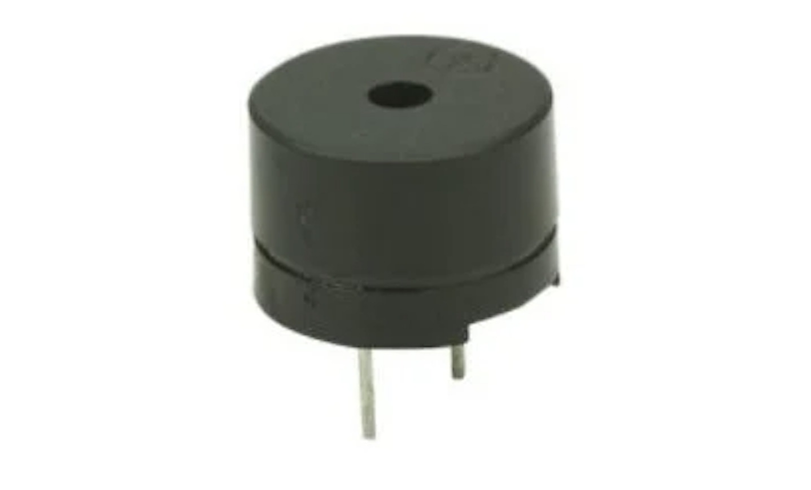
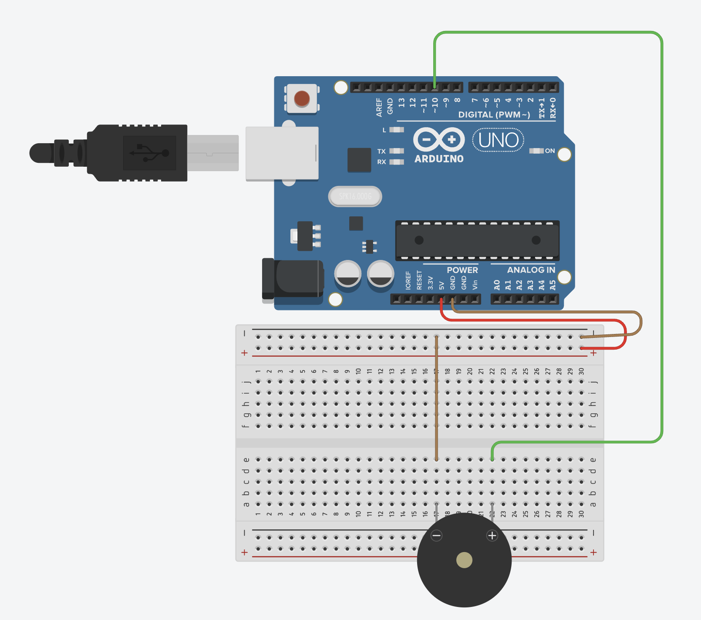
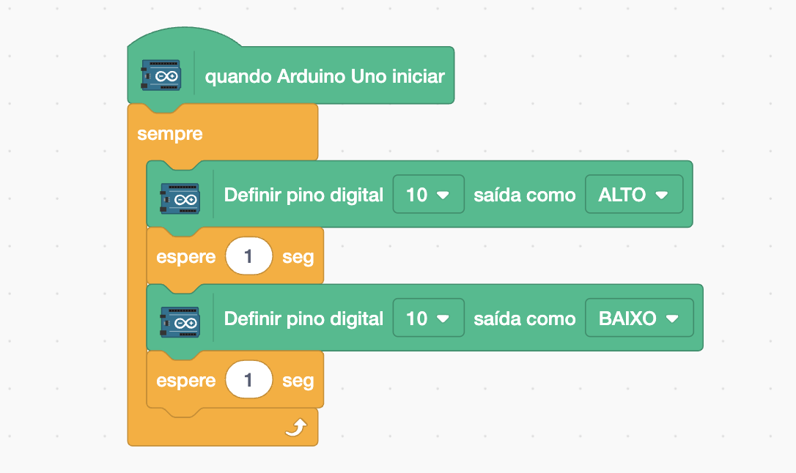

[🏠 Home](../README.md)

#

<h1 align="center">Buzzer Ativo </h1>

## O que é?

Um buzzer é um dispositivo eletrônico que emite sons audíveis. Ele é usado em uma variedade de aplicações para fornecer feedback sonoro, alertas ou sinais de aviso. O Buzzer Ativo possui um circuito interno que gera o som. Basta aplicar uma tensão constante para que ele emita um som contínuo.

## Como utilizar?

Para utilziar o Buzzer Ativo é simples, primeiro vamos implementar o esquemático elétrico a seguir:

E utilizar o seguinte código para ativar o Buzzer a cada 1 segundo.

[🏠 Home](../README.md)

