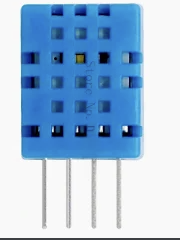
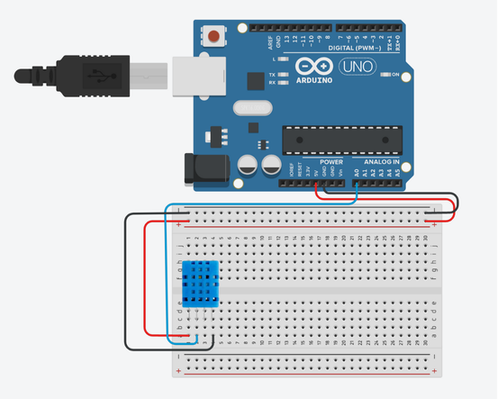
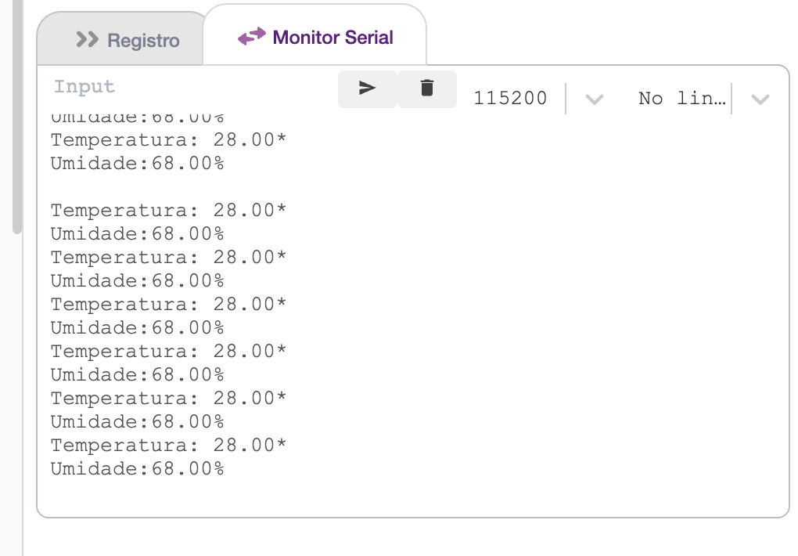

[🏠 Home](../README.md)

#

<h1 align="center">Servo Motor </h1>

## O que é?

O sensor DHT é um tipo de sensor de umidade e temperatura bastante utilizado com placas Arduino e outros microcontroladores. O sensor DHT11: Oferece uma faixa de medição de umidade de 20% a 80% e uma faixa de temperatura de 0°C a 50°C, com precisão de ±5% para umidade e ±2°C para temperatura.

## Como utilizar?

Para utilziar o DHT11 é simples, primeiro vamos implementar o esquemático elétrico a seguir:

Vamos realizar a leitura da temperatura e umidade e exibi-los no Monitor Serial. Para isso, utilizaremos o bloco "Obter de sensor DHT", onde especificamos se queremos ler a umidade ou a temperatura, e também indicamos o pino de leitura, que no nosso caso é o A0. Em seguida, usaremos dois blocos "JUNTE" para concatenar os valores retornados e exibi-los de uma forma mais clara e organizada.

Caso seu projeto funcione conforme planejado a seguinte saída deve ser exibida no Monitor Serial, variando a temperatura e umidade de acordo com o local que você está:

[🏠 Home](../README.md)

