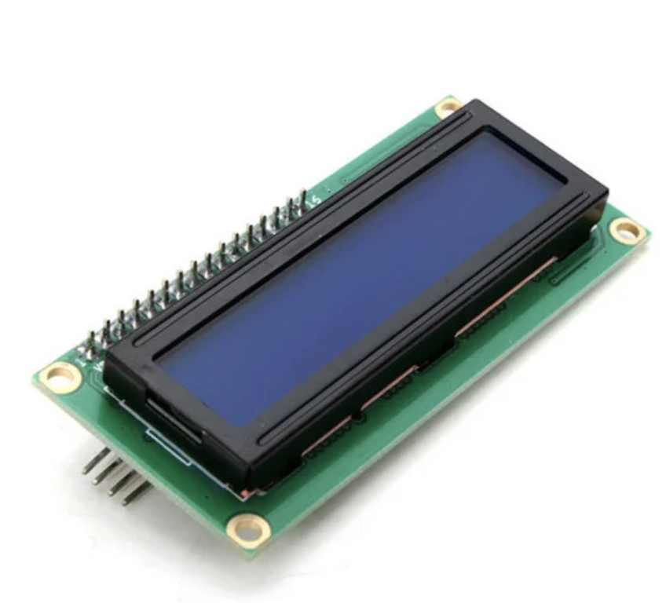
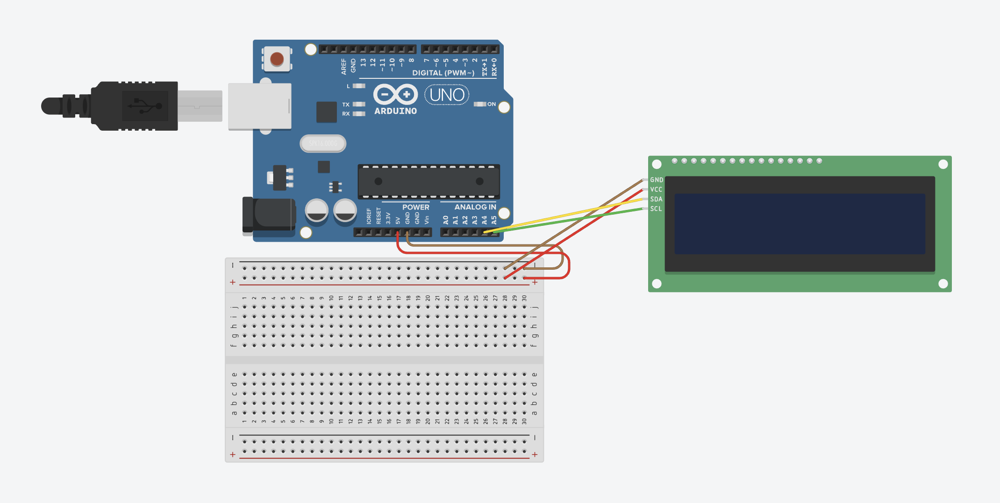
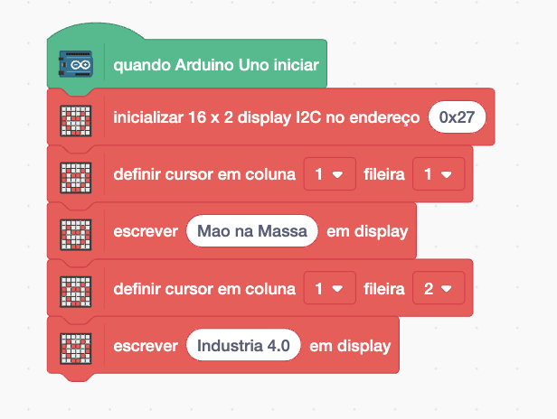
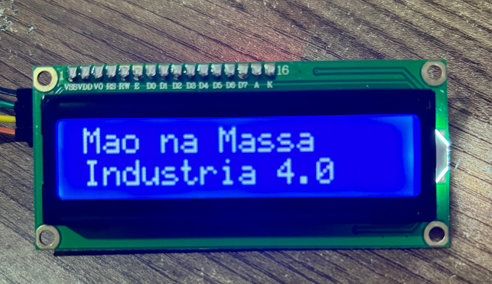

[🏠 Home](../README.md)

#

<h1 align="center">Servo Motor </h1>

## O que é?

> Display Lcd com 16 colunas por 2 linhas, backlight azul e escrita branca. Possui o Módulo I2C integrado. Com esse display, você faz a conexão entre o microcontrolador e o display utilizando apenas os pinos SDA e SCL, deixando as outras portas livres para o desenvolvimento do seu projeto!
> **GND:** Conecte ao GND do Arduino  **VCC:** Conecte ao 5V do Arduino  **SDA:** Conecte ao pino A4 do Arduino (para Arduino Uno)  **SCL:** Conecte ao pino A5 do Arduino (para Arduino Uno) 
> Fonte: https://blog.eletrogate.com/servo-motor-para-aplicacoes-com-arduino/

## Como utilizar?

Para utilziar o LCD 16x2 com Módulo I2C é simples, primeiro vamos implementar o esquemático elétrico a seguir:

O display 16x2 tem a capacidade de exibir 32 caracteres simultaneamente, distribuídos em duas linhas de 16 caracteres cada. Para mostrar o texto "Mão na massa Indústria 4.0", devemos dividir a frase em duas partes: "Mão na massa" na primeira linha e "Indústria 4.0" na segunda linha.

Para realizar essa tarefa, devemos inicializar o LCD com o bloco "Inicializar". Em seguida, usamos o comando "Definir Cursor", que nos permite especificar a coluna e a linha onde o texto do bloco "Escrever" será exibido, conforme a imagem a seguir:

Caso tenha dado tudo certo, o seu projeto deve funcionar da seguinte maneira.

Desafio, centralize o texto.

[🏠 Home](../README.md)

