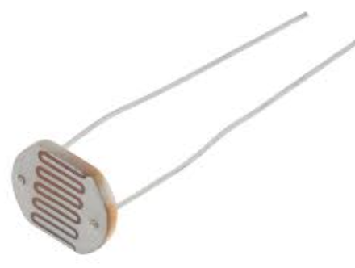
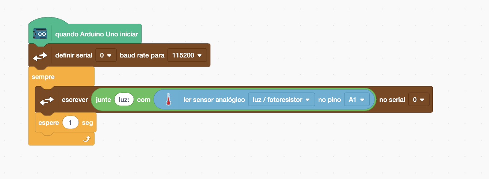

[🏠 Home](../README.md)

#

<h1 align="center">LDR - Resistor Depentende de Luz</h1>

## O que é?

> O LDR (Light Dependent Resistor ou Resistor Depentende de Luz, em tradução literal) é um componente que, como o próprio nome já diz, varia sua resistência conforme a quantidade de luz incidida sobre ele. De forma simples, quanto mais luz o LDR receber, menor será sua resistência. Caso haja pouca luz sobre ele, sua resistência aumenta.
>
> Fonte: https://blog.eletrogate.com/controle-de-brilho-com-ldr/

## Como utilizar?

Para utilziar um LDR é simples, primeiro vamos implementar o esquemático elétrico a seguir:

Vamos realizar a leitura do LDR, e caso esteja muito escuro acionaremos um LED. Para fazer isso vamos primeiro exibir o valor recebido do LDR no Monitor Serial, para pegar o valor do LDR utilizamos o bloco Ler Sensor Analógico e selecionamos luz/fotoresitor.

Quanto maior o valor recebido no LDR mais escuro está o ambiente, logo definimos que se o valor for maior que 900 o LED será ligado e caso seja menor o LED será desligado.

Caso tenha dado tudo certo, o seu projeto deve funcionar da seguinte maneira.

### Para saber mais

Um divisor de tensão é um circuito simples que usa dois resistores em série para reduzir uma tensão de entrada para uma tensão de saída mais baixa. Basicamente, ele "divide" a tensão de entrada em proporções determinadas pelos valores dos resistores. Quer saber ainda mais?

https://www.youtube.com/watch?v=zaq-cIq3LGA

[🏠 Home](../README.md)

