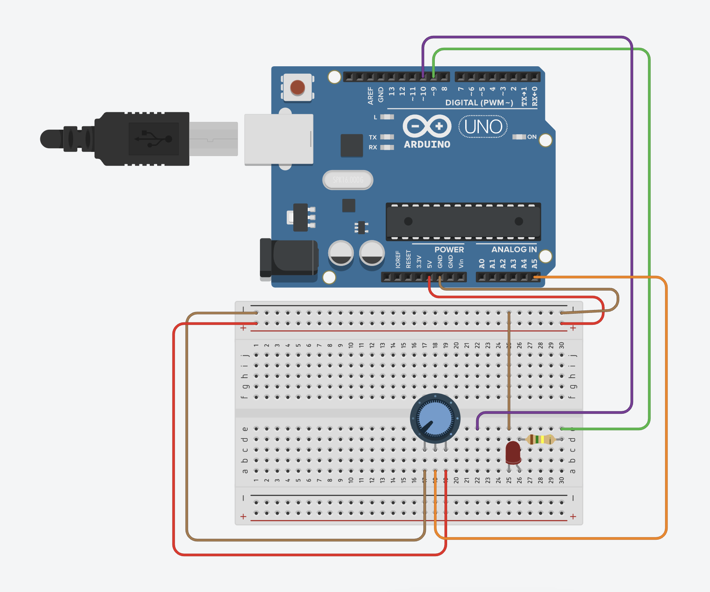
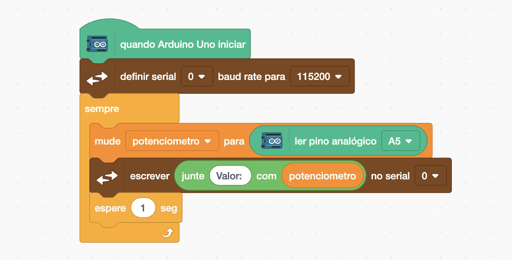
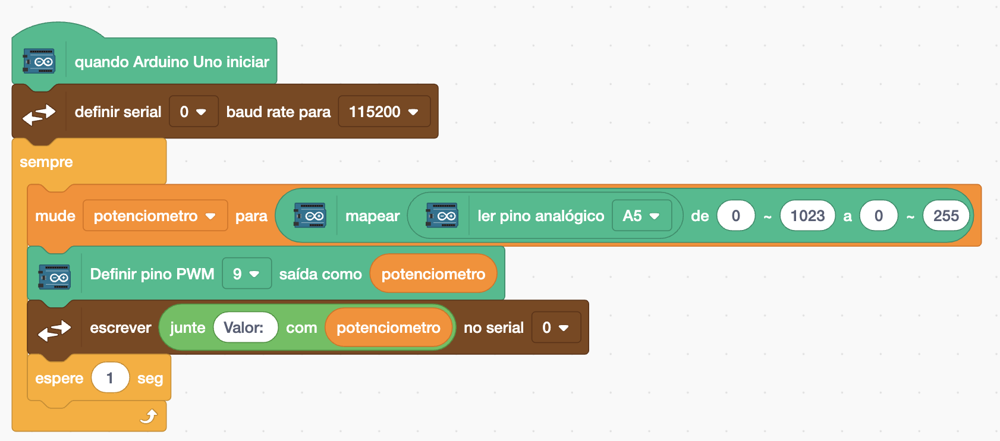

[🏠 Home](../README.md)

#

<h1 align="center">Potenciômetro </h1>

## O que é?

Um potenciômetro de 10k (10.000 ohms) é um tipo específico de resistor variável que permite ajustar a resistência manualmente dentro do intervalo de 0 a 10k ohms. É um componente comum em eletrônica, utilizado para controlar diferentes parâmetros em circuitos, como volume, brilho e posição. A leitura retornará um valor proporcional à posição do cursor, entre 0 e 1023.

## Como utilizar?

Para utilizar o Potenciômetro vamos utilizar o seguinte esquemático elétrico:

E vamos utilizar o seguinte código para exibir o valor recebido no Monitor Serial, perceba que o valor varia entre 0 a 1023.

Vamos atualizar o código para que a medida que mudamos a posição no potenciômetro o LED seja acionado. Vamos atualizar o bloco de código Mapear, que serve reescalar um número de um intervalo para outro. Logo, o valor de 0 a 1023 vai ser transformado em um valor entre 0 e 255.

[🏠 Home](../README.md)

