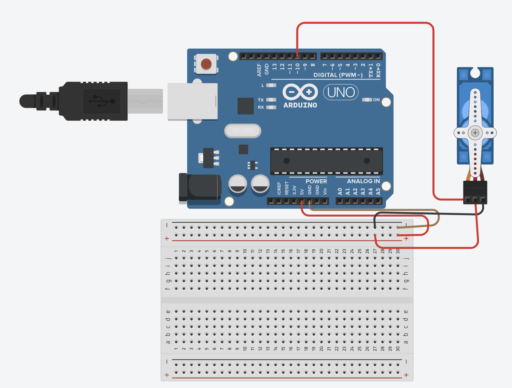

[🏠 Home](../README.md)

#

<h1 align="center">Servo Motor </h1>

## O que é?

> Um servo motor é um equipamento eletromecânico que possui um encoder e um controlador acoplado.
> Diferentemente de motores tradicionais, como de corrente contínua, o servo motor apresenta movimento rotativo proporcional a um comando de forma a atualizar sua posição.
> Ao invés de girar continuamente como os motores de corrente contínua, o servo, ao receber um comando, gira até a posição especificada pelo mesmo. 
> Os Servos **SG90** são acionados por meio de três fios:  > **Vermelho:** Alimentação positiva;  > **Marron:** GND;  > **Laranja:** Sinal de controle PWM;
>
> Fonte: https://blog.eletrogate.com/servo-motor-para-aplicacoes-com-arduino/

## Como utilizar?

Para utilziar o Servo Motor SG90 é simples, primeiro vamos implementar o esquemático elétrico a seguir:

Primeiro vamos deixar o nosso motor na posição 0 e alerar a posição do **servo horn**, altere esse valor posteriormente para 180 para que na posição 0 fique a esquerda e a 180 a direita.

Agora vamos atualizar nosso código para mover o **servo horn** da esquerda para direita com intervalos de 1 segundo.

[🏠 Home](../README.md)

