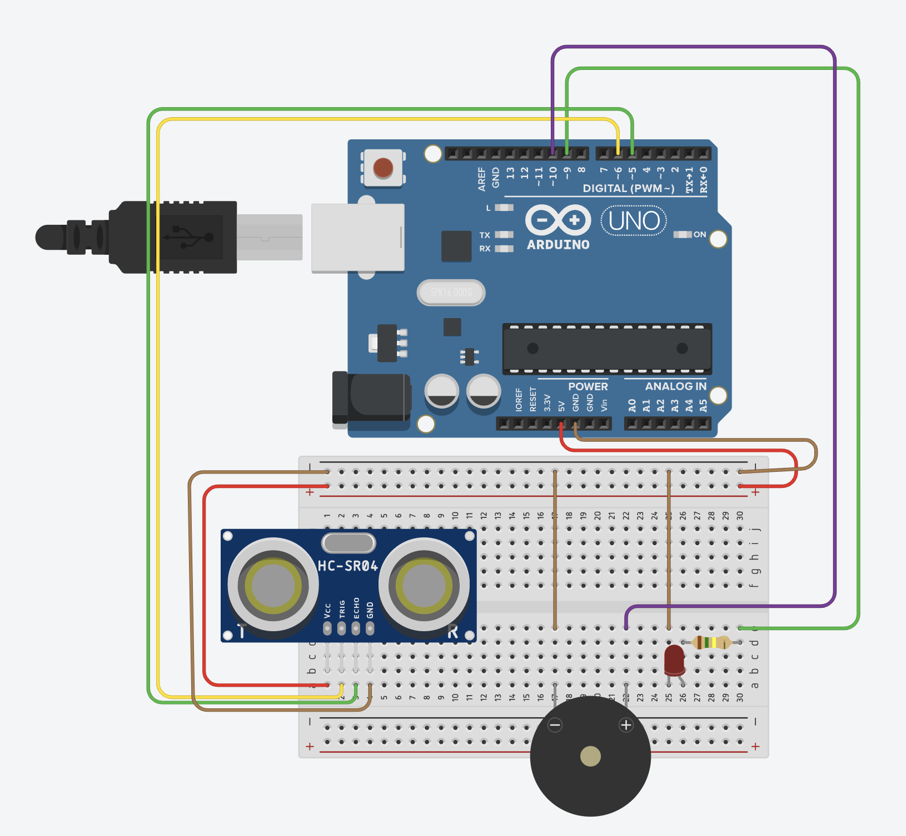
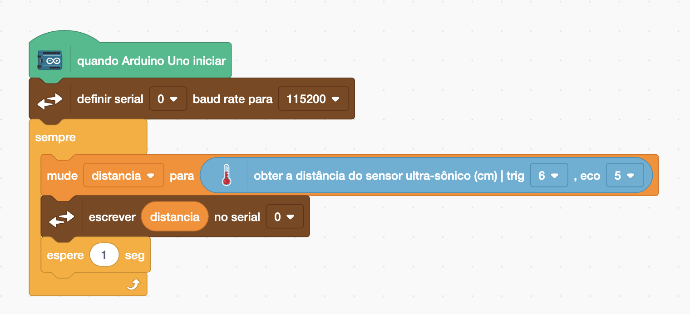
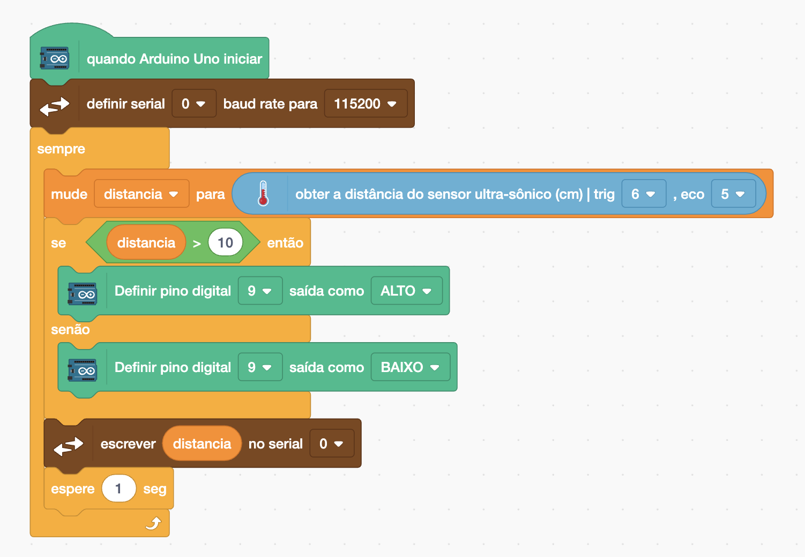
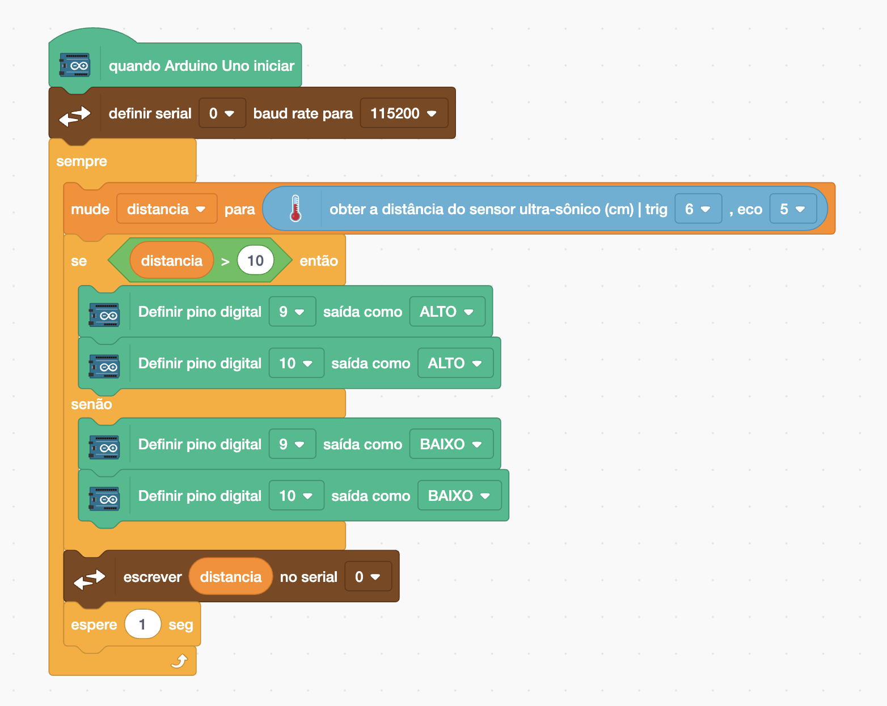

[🏠 Home](../README.md)

#

<h1 align="center">Projeto -  Dector de porta aberta</h1>

## Sobre

Vamos desenvolver um projeto para detectar portas abertas, vamos utilizar:

- Sensor Ultrassônico
- Led
- Resitor
- Buzzer Ativo

O objetivo do nosso projeto é qua quando o sensor ultrassônico detecte que a porta está aberta (distância maior que 10cm), ele acione um led e o buzzer.

## Esquemático elétrico

### Programação

Vamos iniciar exibindo no Motior Serial a distância detectada pelo sensor ultrassônico.

Agora vamos alterar o código para que se a distância for menor que 10cm, ele acione a porta 9 ALTO ou seja o Led ligado e caso for maior igual a 10 ele aciona a porta 9 como BAIXO, ou seja desligado.

Agora além de acionar o LED, vamos acionar o Buzzer, para fazer isso vamos ativar e desativar a porta 10.

Ao finalizar esse código o projeto deve ser capaz de acionar o LED e Buzzer caso a distância seja maior que 10cm.

[🏠 Home](../README.md)

