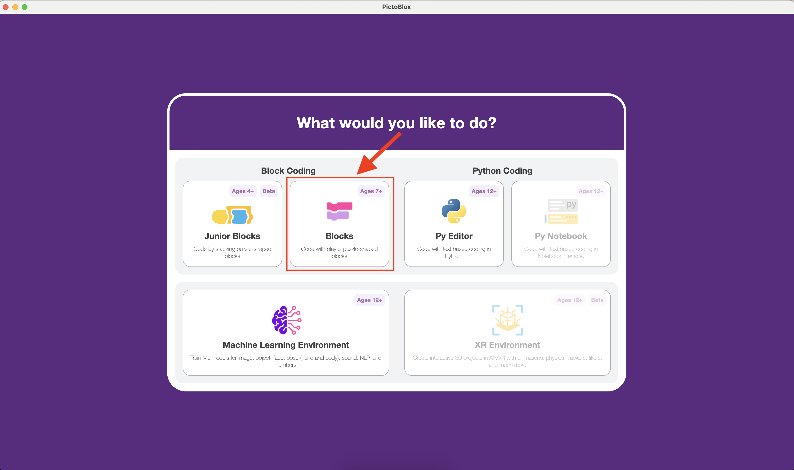
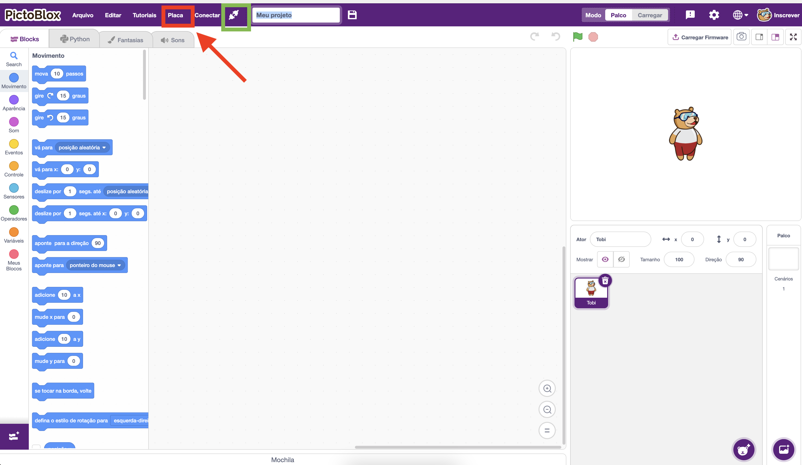
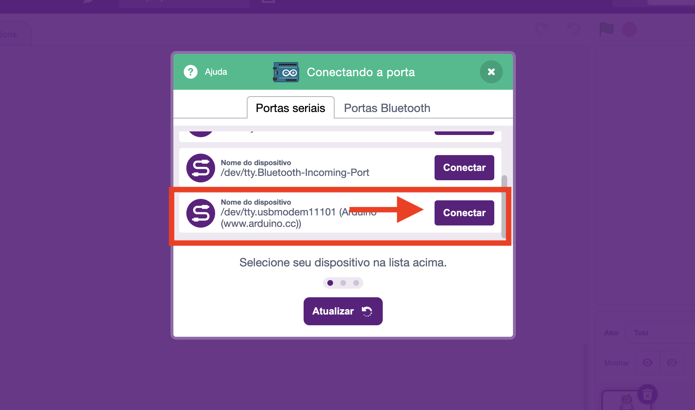
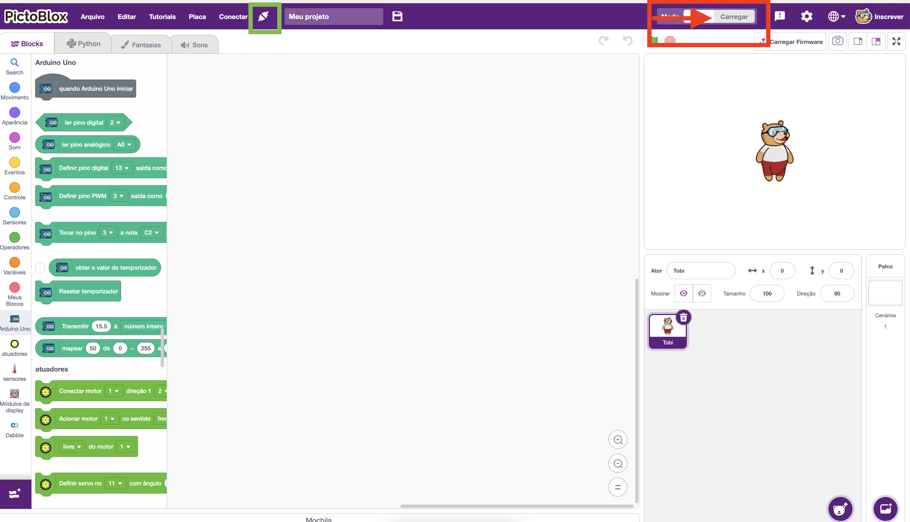
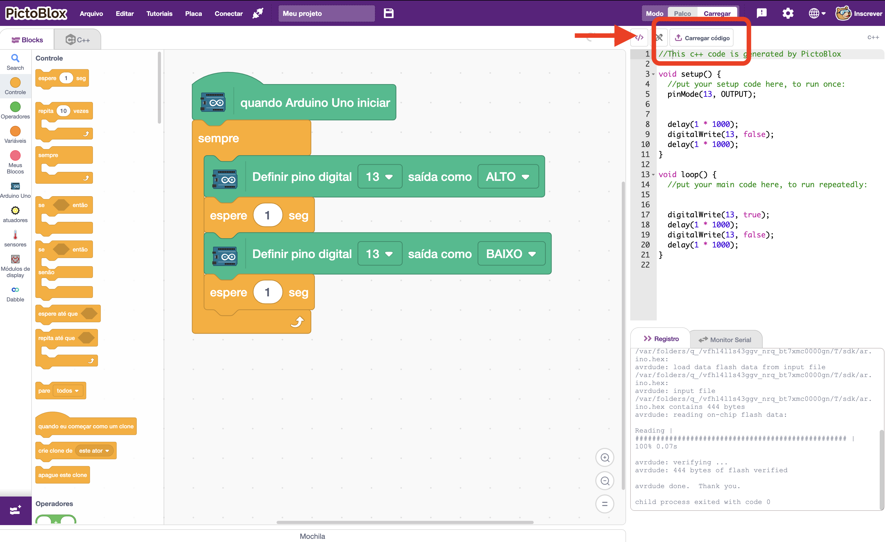

[🏠 Home](../README.md)

#

<h1 align="center">Pictoblox </h1>

## O que é?

> Plataforma revolucionária de programação Python baseada em blocos para crianças e adolescentes aprenderem codificação por meio de projetos criativos e envolventes .
>
> Fonte: https://thestempedia.com/product/pictoblox/

## Conhecendo o Pictoblox

O primeiro passo é abrir o Pictoblox e iniciar nosso projeto craindo um arquivo do tipo Blocos, conforme a imagem a seguir:

Na imagem abaixo, o ícone que indica se há uma placa conectada ou não está destacado com um quadrado verde. No nosso caso, como ainda não conectamos a placa, o ícone de "sem conexão" é exibido. Para conectar, clique na opção "Conectar" no menu.

E em seguida selecionar a placa desejada, no nosso caso Arduino Uno.

Ao conectar a sua placa Arduino via USB no computador ela irá aparecer como uma opção, para realizar a conexão, clique em conectar.

Caso tenha ocorrido tudo bem o ícone de "conectado" é exibido, agora para iniciarmos nossa programação basta clicarmos em carregar, para poder liberar os blocos para serem utilizados no Arduino.

Na maioria das placas de Arduino, há um LED conectado ao pino 13, então como nosso primeiro código, vamos fazer ele piscar a cada 1 segundo com o código a seguir, para carregar o código na placa basta clicar em Carregar Código.

Caso tenha tudo ocorrido bem, o led L da nossa plca vai ficar piscando em intervalos de 1 segundo.

[🏠 Home](../README.md)

