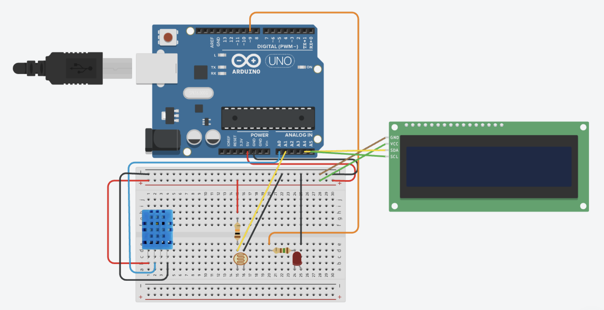
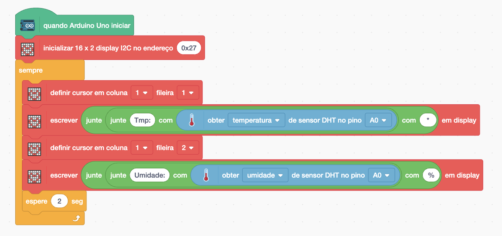
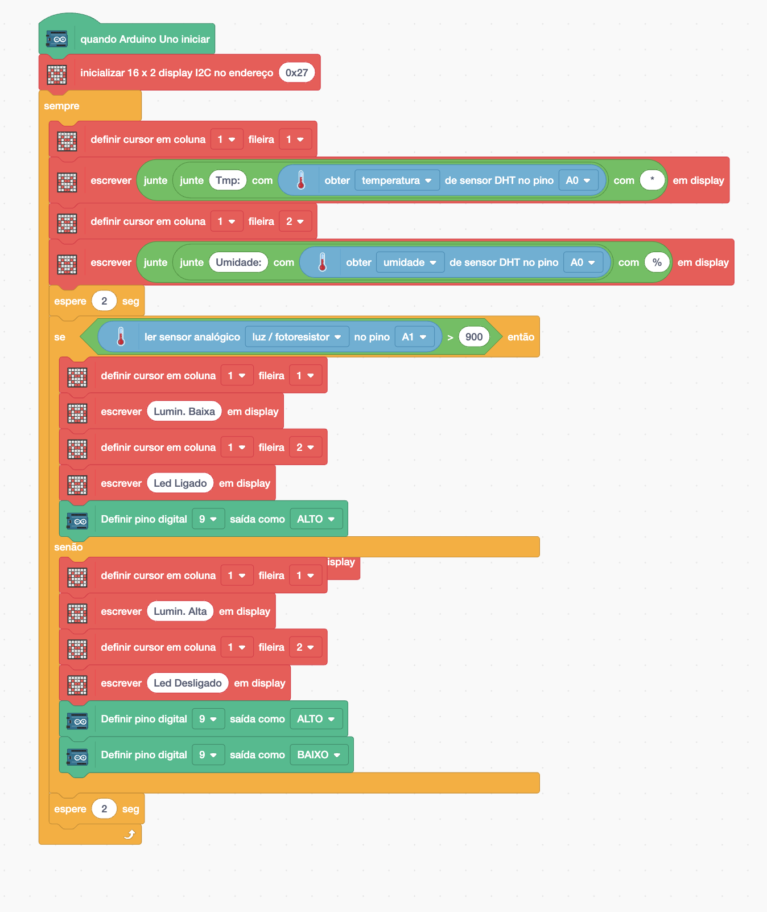
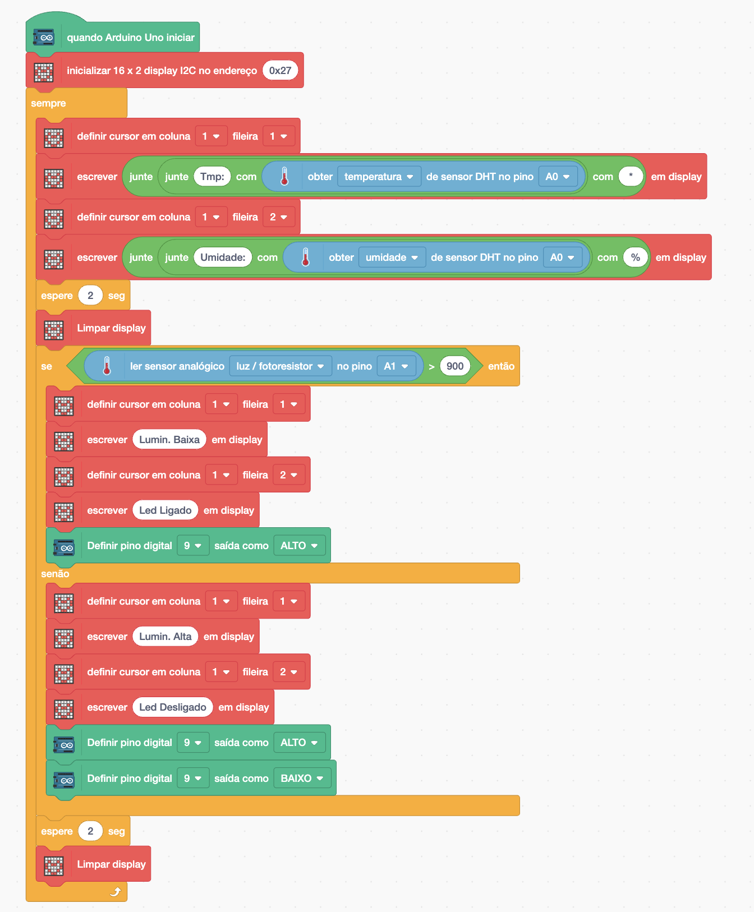
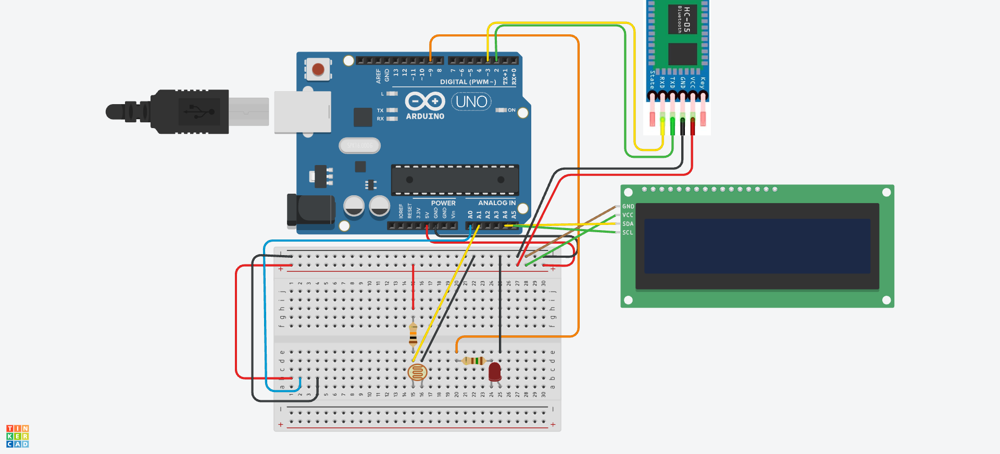
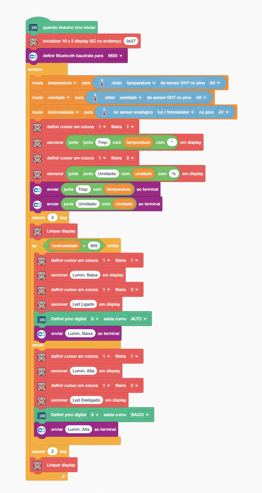

[🏠 Home](../README.md)

#

<h1 align="center">Projeto - Monitor de Ambiente </h1>

## Sobre

Vamos desenvolver um projeto que exibe alternadamente no display a temperatura e a umidade, e depois mostra se a luminosidade está baixa ou alta e o status do LED, se está ligado ou desligado. Além disso se o LDR estiver maior que 900 o LED deve ser ligado. Também vamos conectar com o Smartphone para exibir temperatura, umidade e luminosidade.

## Esquemático elétrico

### Programação

Vamos iniciar exibindo no display A temperatura e a Umidade, conforme o código a seguir:

Em seguida, vamos atualizar o código verificando o valor do LDR. Se o valor for maior que 900 (indicando baixa luminosidade), o LED devera ser ligado e o display mostrará "Lumin. Alta" na primeira linha e "Led Ligado" na segunda linha. Caso o valor do LDR seja menor que 900, o LED é desligado e o display exibirá "Lumin. Baixa" na primeira linha e "Led Ligado" na segunda linha.

Para corrigir o problema dos caracteres que não sumiram ao trocar o texto, devemos usar o bloco **Limpar Display**.

Caso tenha dado tudo certo, o seu projeto deve funcionar da seguinte maneira.

Agora vamos atualizar nosso projeto para exibir as informações de: temperatura, umidade e luminosidade no seu Smartphone, conforme esquemático e códigos a seguir:

## Esquemático elétrico 2

## Codificação atualizada

[🏠 Home](../README.md)

