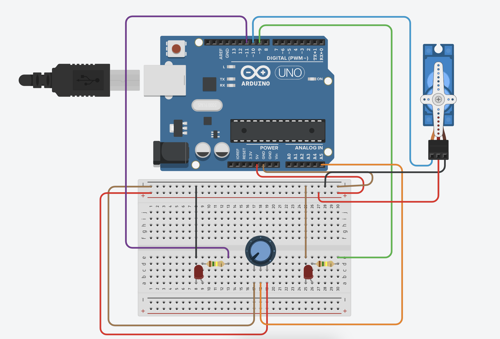

[🏠 Home](../README.md)

#

<h1 align="center">Projeto - Indicador de direção </h1>

## Sobre

Vamos desenvolver um projeto que ao usarmos um potenciômetro irá ser acionado um Servo Motor SG90, e devera ser incicado por meio de dois leds para que direção estamos movendo o servo motor/potenciômetro.

- Potenciômetro
- Leds
- Resitores
- Buzzer Ativo
- Motor SG90

## Esquemático elétrico

### Programação

Vamos iniciar exibindo no Motior Serial a posição do potenciômetro.

Agora vamos atualizar nosso código para que se a posição for mario que 90 acione o LED da porta 9 como ALTO e caso seja menor do que 90 acione o LED da porta 11 como ALTO.

Vamos altear o código para mover o motor de acordo com o valor da variável **potenciomentro** e em seguida usar os blocos **se** para verificar se devemos acionar o LED da esquerda ou da direita.

Caso tenha dado tudo certo, o seu projeto deve funcionar da seguinte maneira.

[🏠 Home](../README.md)

