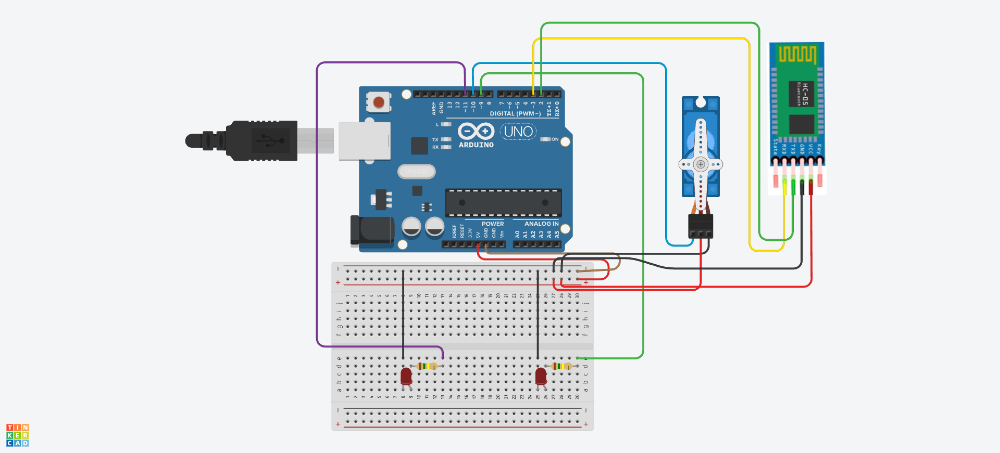
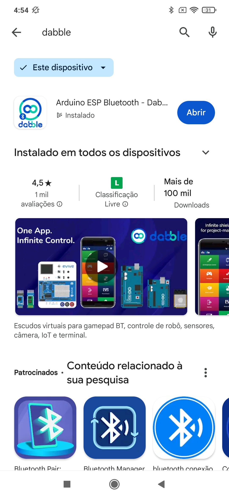
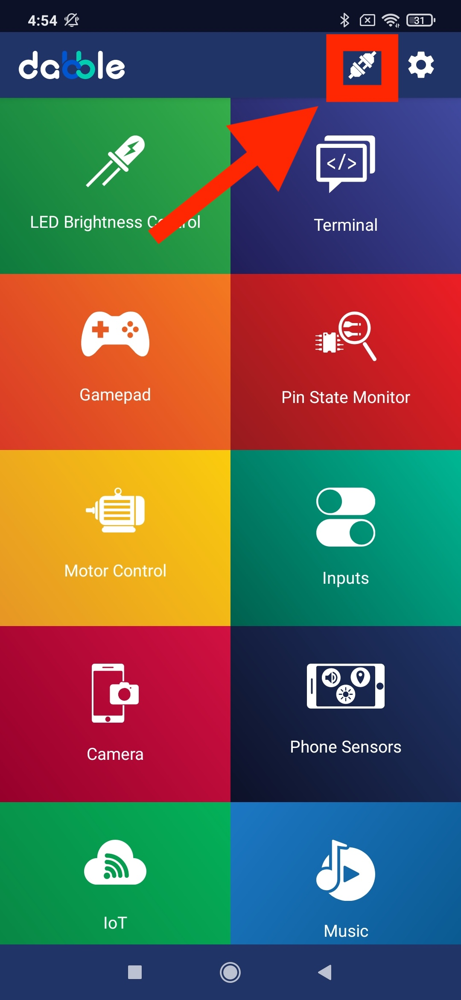
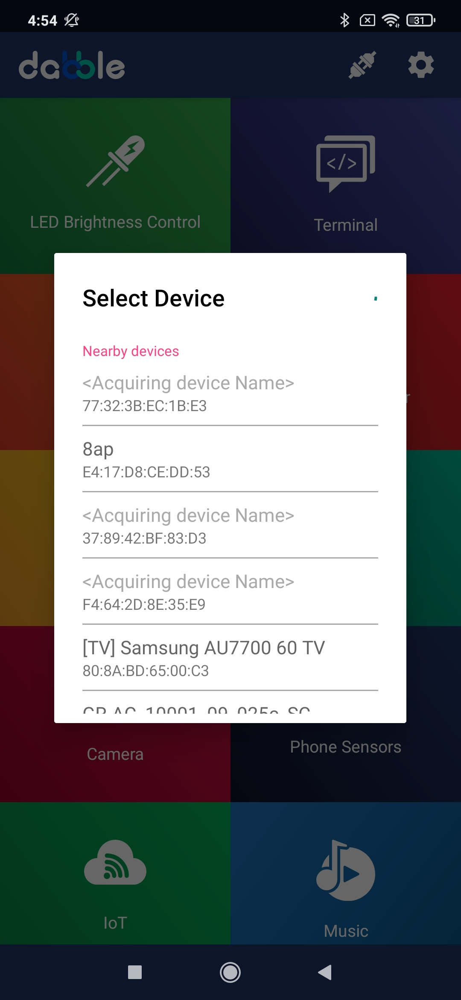
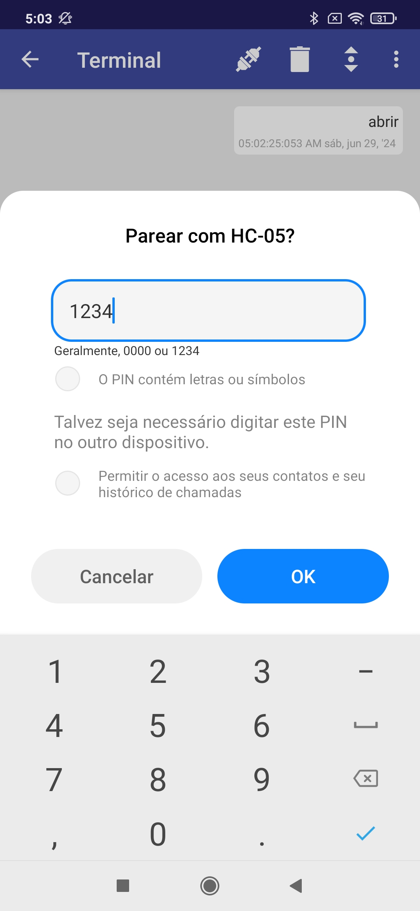
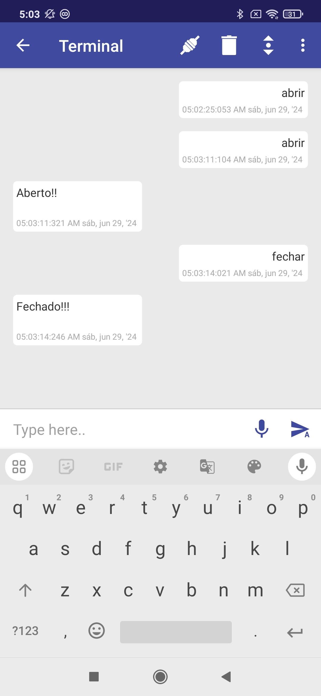
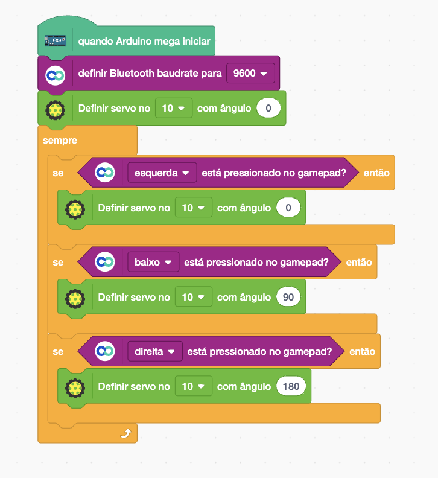
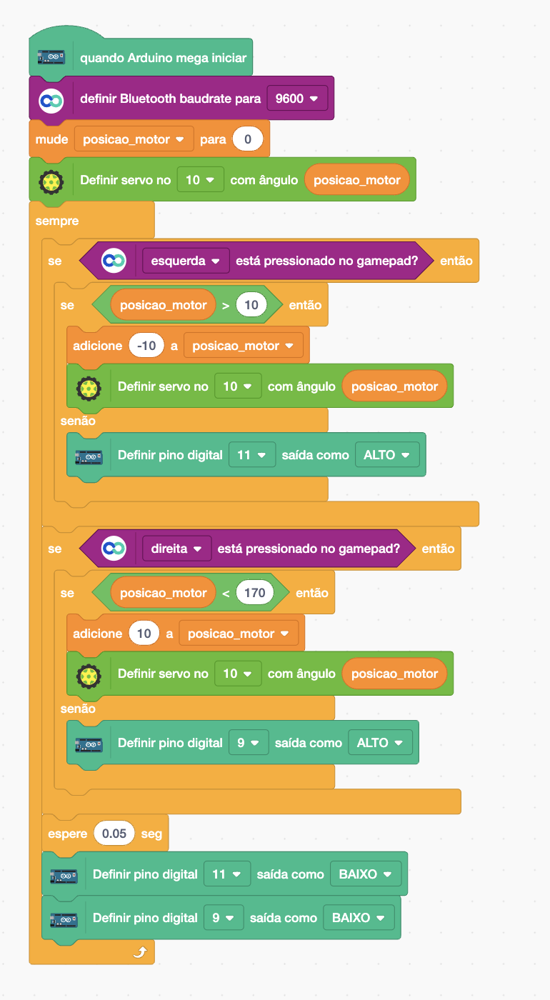

[🏠 Home](../README.md)

#

<h1 align="center">Projeto - Controlar Servo Motor via Smartphone </h1>

## Sobre

Vamos desenvolver um projeto onde iremos mover nosso motor via Smartphone e devera ser incicado por meio de dois leds a posição máxima que nosso motor pode se mover.

- Módulo Bluetooth HC-05
- Leds
- Resitores
- Buzzer Ativo
- Motor SG90

## Esquemático elétrico

### Programação

Vamos inciar nosos código habilitando o uso do bluetooth por meio do bloco **Definir Bluetooth** do tipo Dabble. Em seguida definir a posição do motor para 0. Existem diversas interfaces para interagir com o arduino via aplicativo Dabble, uma delas é o terminal. Por meio dele podemos mandar comandos de texto como o exemplo a seguir, onde vamos mandar os comandos "abrir"e "fechar", conforme o exemplo de código a seguir.

Para utilizar nosso código precisamos baixar primeiro o Dabble na PlayStore, conforme imagem a seguir:

Em seguida clicar no ícone conectar.

Selecionar nosso dispositivo.

Caso solicite, a senha padrão é 1234.

Agora basta ir em Terminal e testar os comandos: **Abrir e Fechar**. Caso esteja tudo certo, o retorno deve ser semelhante a imagem a seguir:

Vamos agora testar uma outra interface a **Gamepad**, para isso vamos atualizar nosso código para o nosso motor se mover de acordo com os comandos: esquerda, baixo e direita.

Podemos aprimorar nosso código para usar direita e esquerda para mover nosso motor de forma gradual da seguinte maneira:

No exemplo anterior não tem nenhum controle para o valor da variável posicao_motor, o que faz com que tente mover o motor a valores maiores ou menores do que o esperado, para contornar isso vamos controlar o valor da variável e acender os leds quando alcançar o valor máximo de acordo com a direção, conforme exemploa seguir:

[🏠 Home](../README.md)

