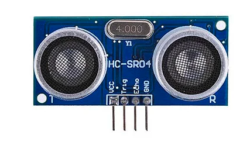
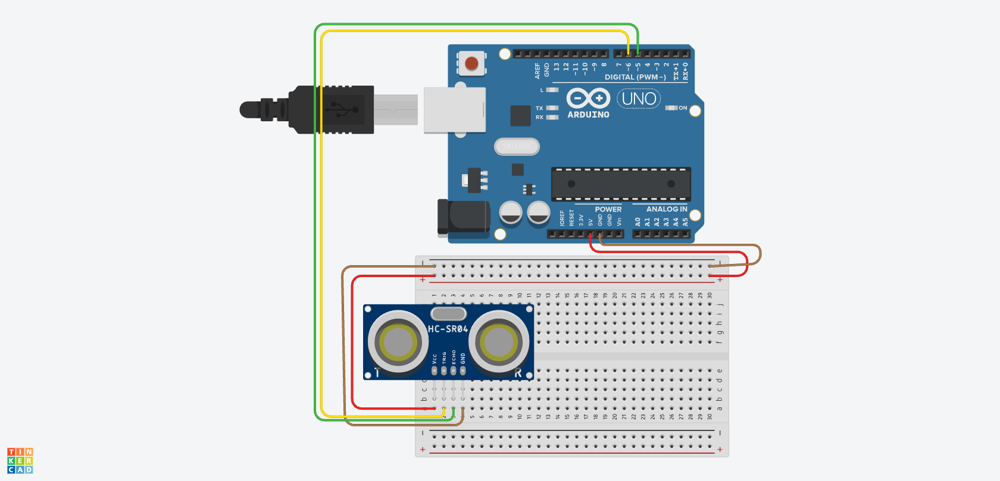
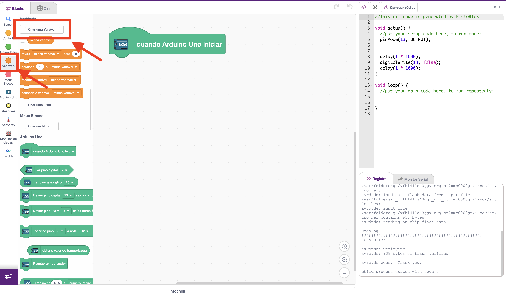
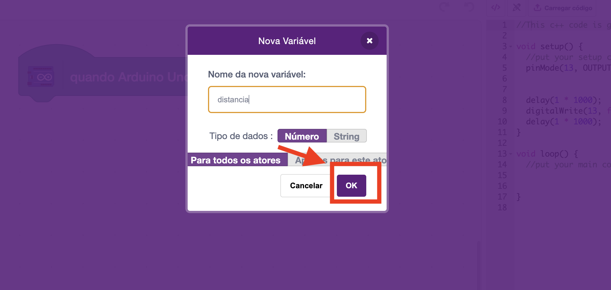
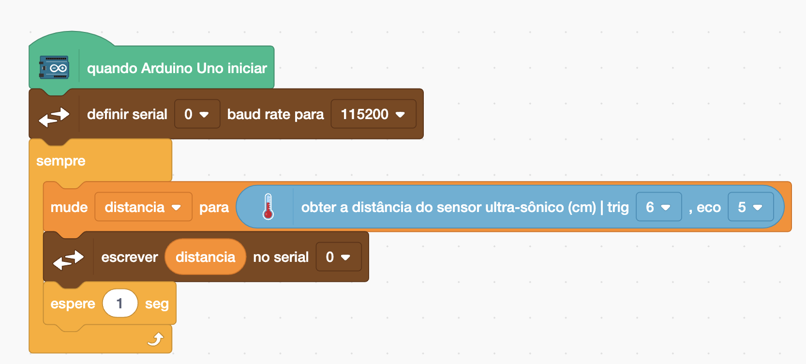
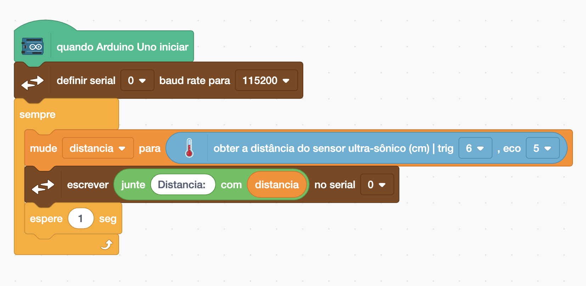
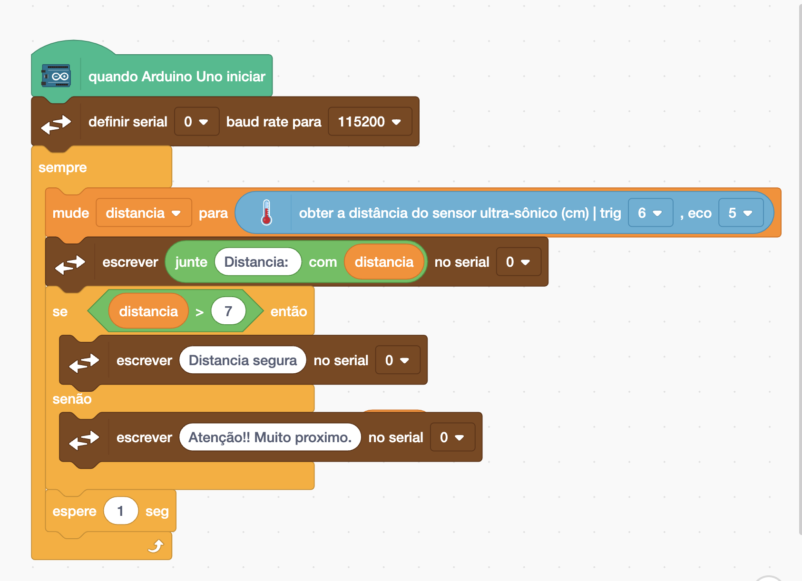
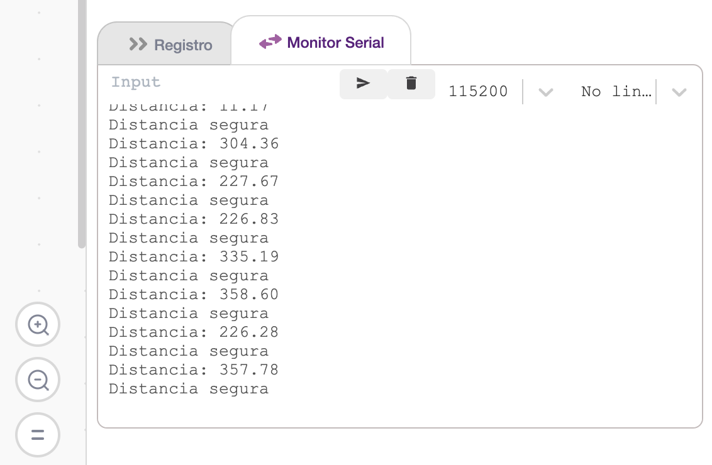

[🏠 Home](../README.md)

#

<h1 align="center">Sensor ultrassônico </h1>

## O que é?

> Sensores ultrassônicos são aplicados como um detectores de objetos e são muito populares principalmente na robótica, onde são utilizados para identificar obstáculos e corrigir continuamente o trajeto feito por um robô. 
> É composto de três partes principais:   **Transmissor Ultrassônico** – Emite as ondas ultrassônicas que serão refletidas pelos obstáculos;  **Um receptor** – Identifica o eco do sinal emitido pelo transmissor;  **Circuito de controle** – Controla o conjunto transmissor/receptor, calcula o tempo entre a emissão e recepção do sinal; O sensor possui 4 pinos:  **VCC** alimentado com 5V.  **GND** Filtro de densidade neutra. **Trigger**, no qual nós aplicamos o sinal para comandar o envio dos pulsos ultrassônicos; **Echo**, que retorna para o Arduino os pulsos com o tempo de duração entre o envio e recepção do sinal de retorno.
>
> Fonte: https://blog.eletrogate.com/sensor-ultrassonico-hc-sr04-com-arduino/

## Projeto - Trena Digital

No projeto "Trena Digital", os participantes irão construir um dispositivo que mede a distância até um objeto utilizando um sensor ultrassônico conectado a um Arduino.

A solução deve exibir a distância atual e em seguida a mesagem: "Atencao!! Muito proximo" se a distância for menor 7cm e "Distancia segura"caso seja maior ou igual a 7cm no Monitor Serial.

Este projeto proporciona uma introdução prática ao uso de sensores com Arduino e oferece uma base sólida para projetos mais complexos no futuro.

### Esquema de Montagem Sensor HC-SR04 com arduino

### Montagem

Para montagem, vamos colocar o sensor ultrassônico na extremidade para que os fios não interfiram na leitura da distância, conforme imagem a seguir.

### Vamos programar?

Primeiro vamos criar nossa variável chamada "distância", que sera utilizada para armazenar o valor retornado pelo sensor ultrassônico. Primeiro clicamos em variáveis e depois em criar variável.

Definimos o nome da variável e em seguida clicamos em OK, depois disso é criado um ela ficara diponível para uso.

Vamos atualizar nosso código conforme a imagem a seguir, onde:

**Para sempre:** O código contido nele será executado em loop, "para sempre", até que seja pausado. 
**Mude:** recebe como primeiro parâmetro a variável **distancia** que vai armezar o valor informado no segundo parâmetro. Que nesse caso é um bloco do tipo Entrada, que é a leitura do sensor ultrassônico. 
**Imprimir no monitor serial:** Exibe o valor da distância no monitor serial.

No terminal serial agora é mostrado a distância de acordo com a leitura do sensor, para melhorar nosso projeto, vamos inserir o texto "Distancia :", antes do valor, para fazer isso vamos utilizar o operador Junte, que faz a junção/concatenação de dois valores, conforme código a seguir:

No nosso projeto, precisamos exibir uma mensagem de acordo a distância percebida pelo sensor, para fazer isso iremos utilizar o operador SE, que verifica se uma condição é verdadeira, e caso SIM, executa o primeiro intervalo de código, e caso não, executa o "outro". Em conjunto com o SE utilizamos o operador ">", que se caso o parâmetro 1 for maior que o parâmetro 2, ele retorna verdadeiro e executa a primeira seção do bloco.

Caso tenha dado tudo certo, a saída do Monitor Serial deve ser apresentada do seguinte modo:

### Informação Extra - O que é uma variável?

> Uma variável é um local na memória principal, isto é, um endereço que armazena um conteúdo. Em linguagens de alto nível, nos é permitido dar nome a esse endereço para facilitar a programação (Lopes 2002).

> As variáveis são elementos básicos na programação, pois são aquelas que armazenam os dados que precisamos no nosso algoritmo. Cada dado pode ser de um tipo diferente e, por isso precisamos mostrar ao nosso algoritmo logo no início o que esperar armazenar. (Devmedia).

[🏠 Home](../README.md)

