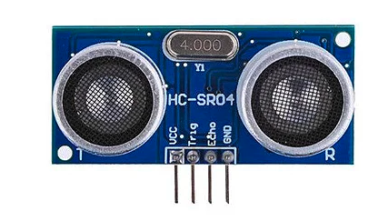

[🏠 Home](../README.md)

#

<h1 align="center">Sensor ultrassônico </h1>

## O que é?

> Sensores ultrassônicos são aplicados como um detectores de objetos e são muito populares principalmente na robótica, onde são utilizados para identificar obstáculos e corrigir continuamente o trajeto feito por um robô. 
> É composto de três partes principais:   **Transmissor Ultrassônico** – Emite as ondas ultrassônicas que serão refletidas pelos obstáculos;  **Um receptor** – Identifica o eco do sinal emitido pelo transmissor;  **Circuito de controle** – Controla o conjunto transmissor/receptor, calcula o tempo entre a emissão e recepção do sinal; O sensor possui 4 pinos:  **VCC** alimentado com 5V.  **GND** Filtro de densidade neutra. **Trigger**, no qual nós aplicamos o sinal para comandar o envio dos pulsos ultrassônicos; **Echo**, que retorna para o Arduino os pulsos com o tempo de duração entre o envio e recepção do sinal de retorno.
>
> Fonte: https://blog.eletrogate.com/sensor-ultrassonico-hc-sr04-com-arduino/

## Projeto - Trena Digital

No projeto "Trena Digital", os participantes irão construir um dispositivo que mede a distância até um objeto utilizando um sensor ultrassônico conectado a um Arduino.

A solução deve exibir a distância atual e em seguida a mesagem: "Atencao: Muito proximo" se a distância for menor 70cm e "Distancia segura"caso seja maior ou igual a 70cm no Monitor Serial.

Este projeto proporciona uma introdução prática ao uso de sensores com Arduino e oferece uma base sólida para projetos mais complexos no futuro.

[🏠 Home](../README.md)

